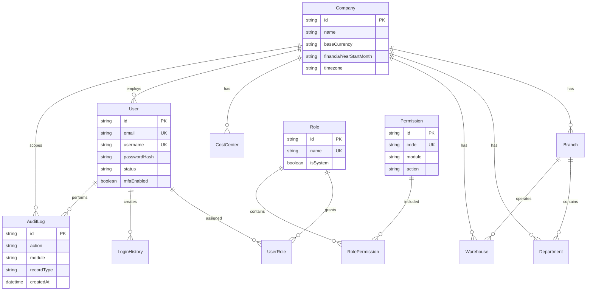

# Database Entity Relationship Diagram

Phase 1 stores organisation, identity, permissions, login history, and audits. Later phases will add master data, document workflows, stock ledger, and double-entry ledger entities.
