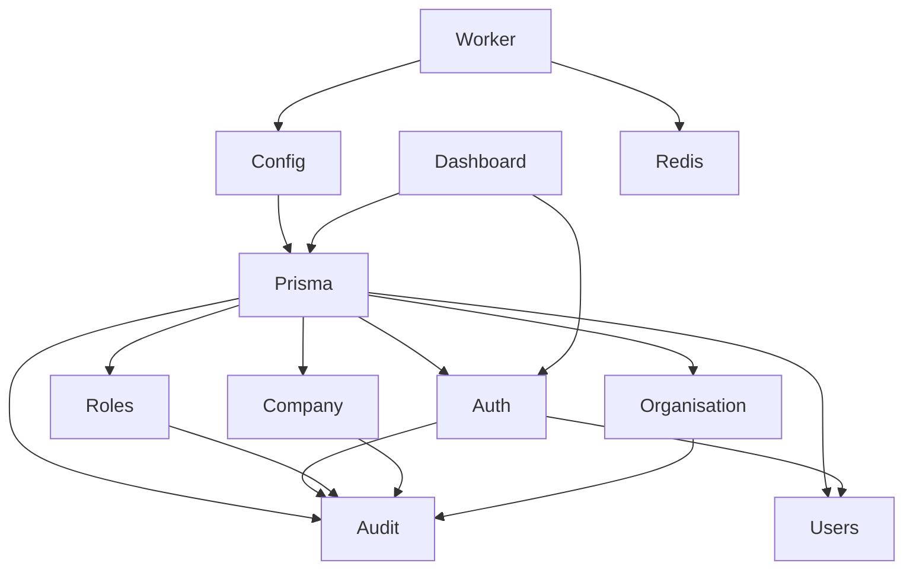

# Module Dependency Map

Rules:

- Controllers depend on services, not repositories directly.
- Services own business logic and transaction boundaries.
- Guards enforce authentication and permissions before controller handlers run.
- Audit logging is append-only and called by services after meaningful state changes.
- Shared packages contain constants and schemas only; they do not import application code.
